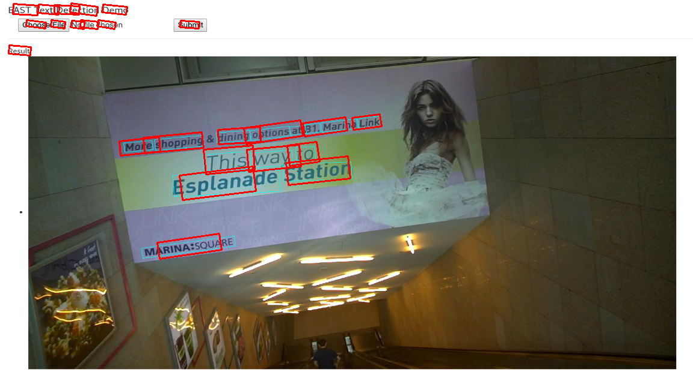
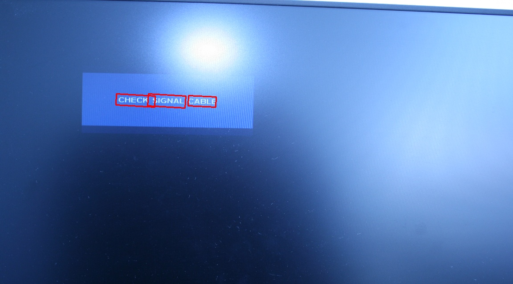
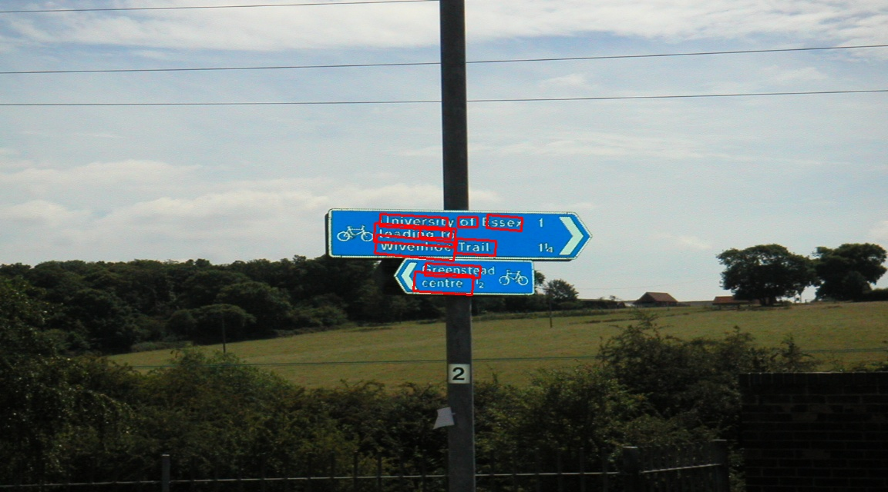
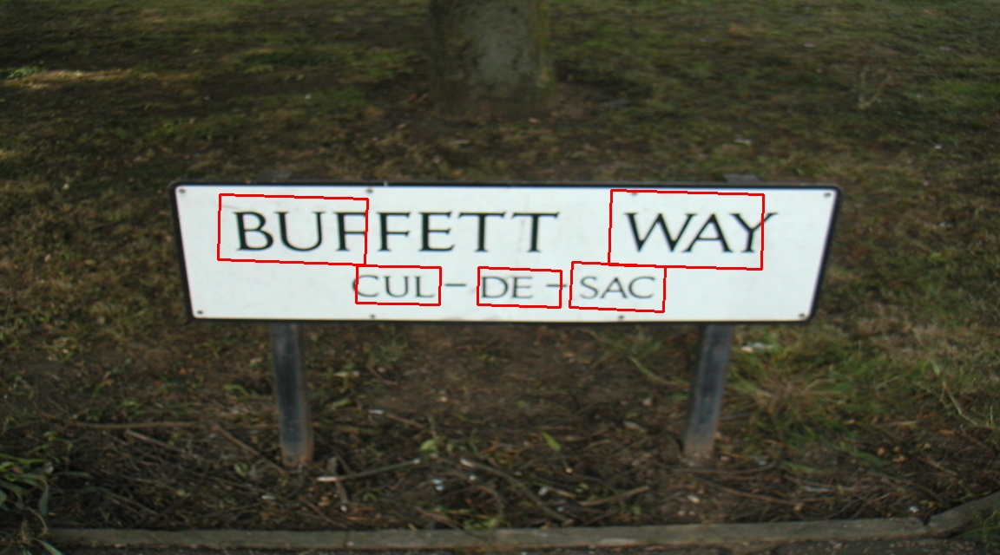
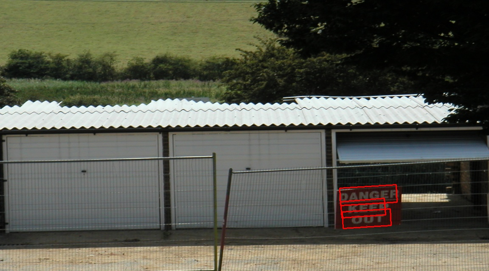
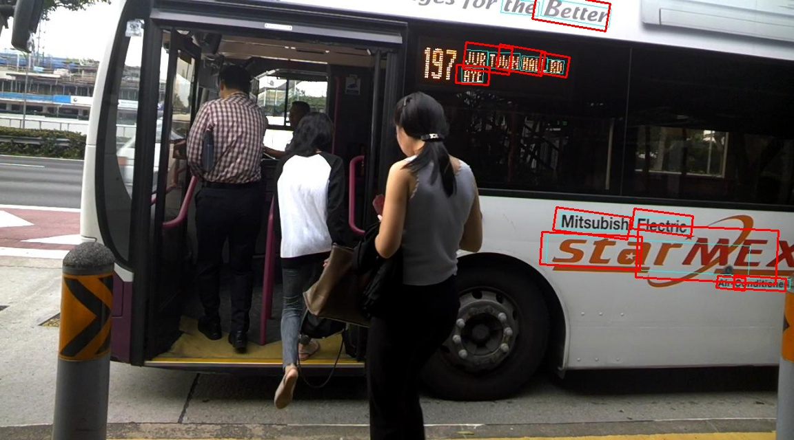

# EAST: An Efficient and Accurate Scene Text Detector
This is a mxnet version of [An Efficient and Accurate Scene Text Detector](https://arxiv.org/abs/1704.03155v2) project

### Introduction
This is a mxnet re-implementation of [EAST: An Efficient and Accurate Scene Text Detector](https://arxiv.org/abs/1704.03155v2).
The features are summarized blow:

+ Only **RBOX** part is implemented.
+ A fast Locality-Aware NMS in C++ provided by the paper's author.
+ Differences from original paper
	+ Use ResNet-50 rather than PVANET
	+ Use dice loss (optimize IoU of segmentation) rather than balanced cross entropy
	+ Use linear learning rate decay rather than staged learning rate decay
+ Speed on 720p (resolution of 1280x720) images:
	+ Now
		+ Graphic card: TiTan X
		+ Network fprop: **~34 ms**
		+ NMS (C++): **~6ms**
		+ Overall: **~24 fps**

Please cite his [paper](https://arxiv.org/abs/1704.03155v2) if you find this useful.

### Other Implementations
Thank you all for the efforts! If you have new implementation and want to share with others, feel free to make a pull request or email me!
1. the origin github implementations [tensorflow](https://github.com/argman/EAST.git)

### Contents
1. [Installation](#installation)
2. [Download](#download)
3. [Test](#train)
4. [Train](#test)
5. [Examples](#examples)

### Installation
1. Any version of mxnet version > 0.12.0 should be ok.

### Download
1. Pre-trained Model on ICDAR 2015 (training set): [BaiduYun link](https://pan.baidu.com/s/1pMyJv6b) 
2. ICDAR 2015 dataset: [BaiduYun link](https://pan.baidu.com/s/1ht81dnm)

### Train
If you want to train the model, you should provide the dataset path, in the dataset path, a separate gt text file should be provided for each image
and run train_mx.py file


If you have more than one gpu, you can set gpu ids to gpu_list(like'0,1,2,3')


### Test
run
```
python2 demo.py
```

a text file will be then written to the output path.


### Examples
Here are some test examples on icdar2015, enjoy the beautiful text boxes!







Please let me know if you encounter any issues(my email wangpan8154@163.com and my wechat wp2572201844).
